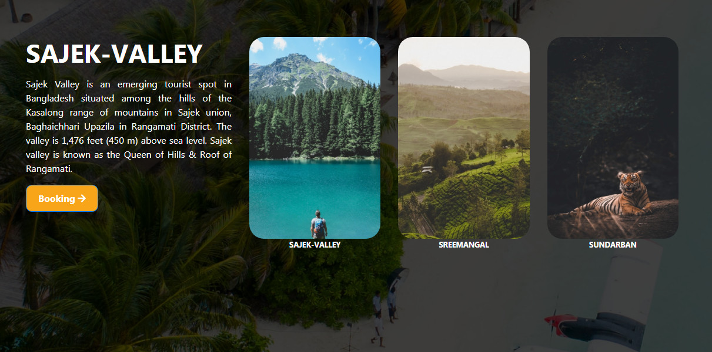
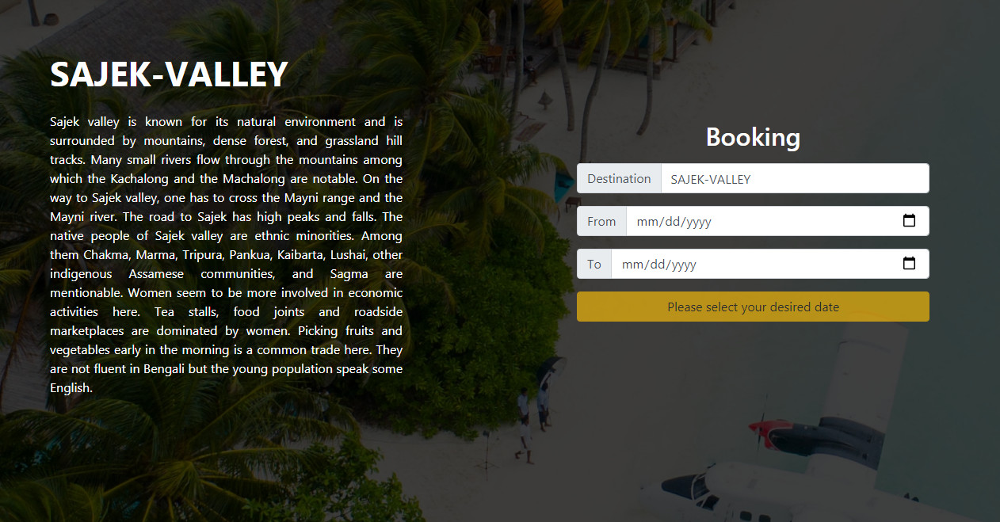
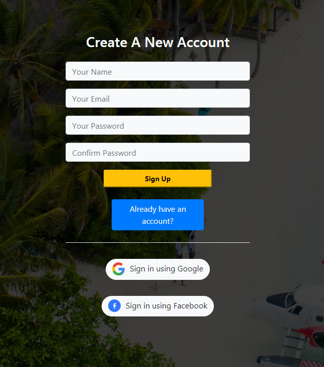
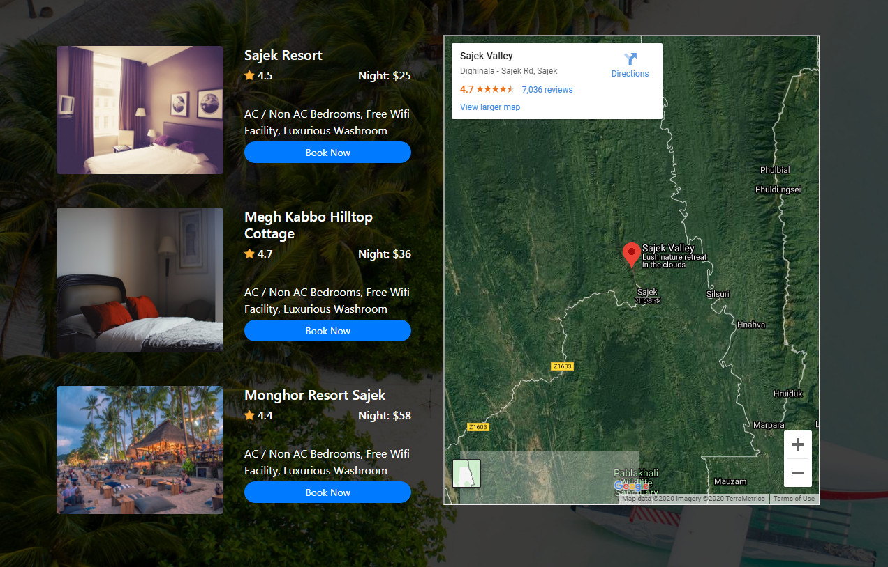

# Resume Drive Link : https://drive.google.com/file/d/1tTgnJOqapxgjETIjJMTAT3s0RixQS0tl/view?usp=sharing
# Live Website Link : https://travel-guru-69cf0.web.app

# Home Page

# Booking Page

# Login Or Sign Up Page

# Details Page with Dynamic Google

# Project Details

<ul>
  <li>A travel agency always need a website to promote their business . Thats why i made a website for learning purpose.</li>
  <li>Traveler can select one option of destination from 3 locations , login or sign up form and has a booking page where some information of destination and also destination tracking using google map.</li>
  <li>Implement my whole knowledge of react , react router , react context api , firebase for deploy and the important thing is i use dynamic google map in this project.</li>
</ul>
